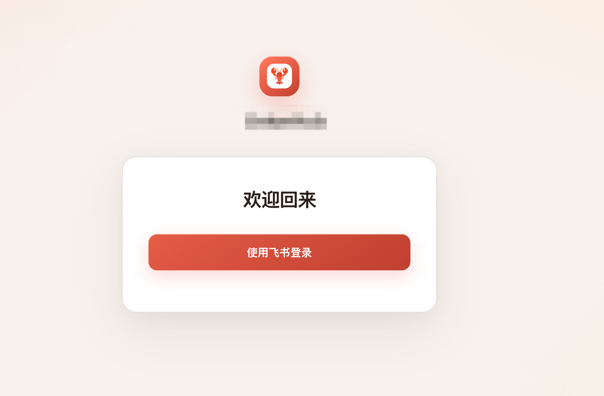
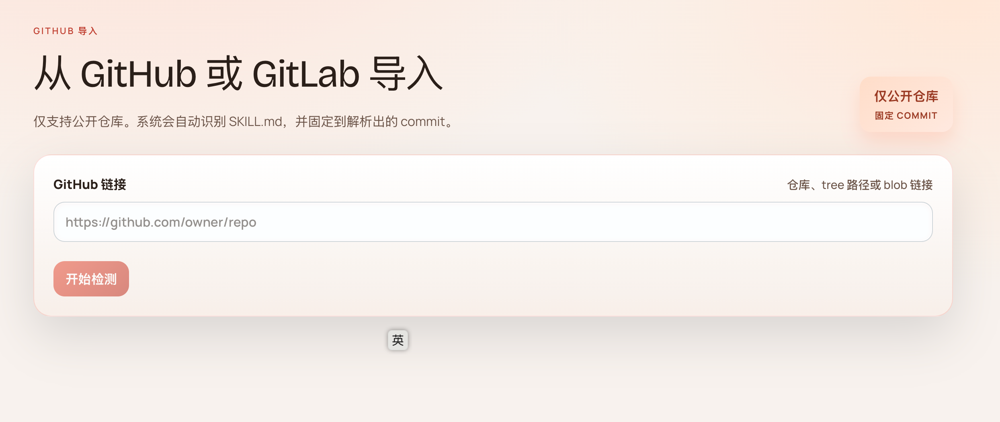
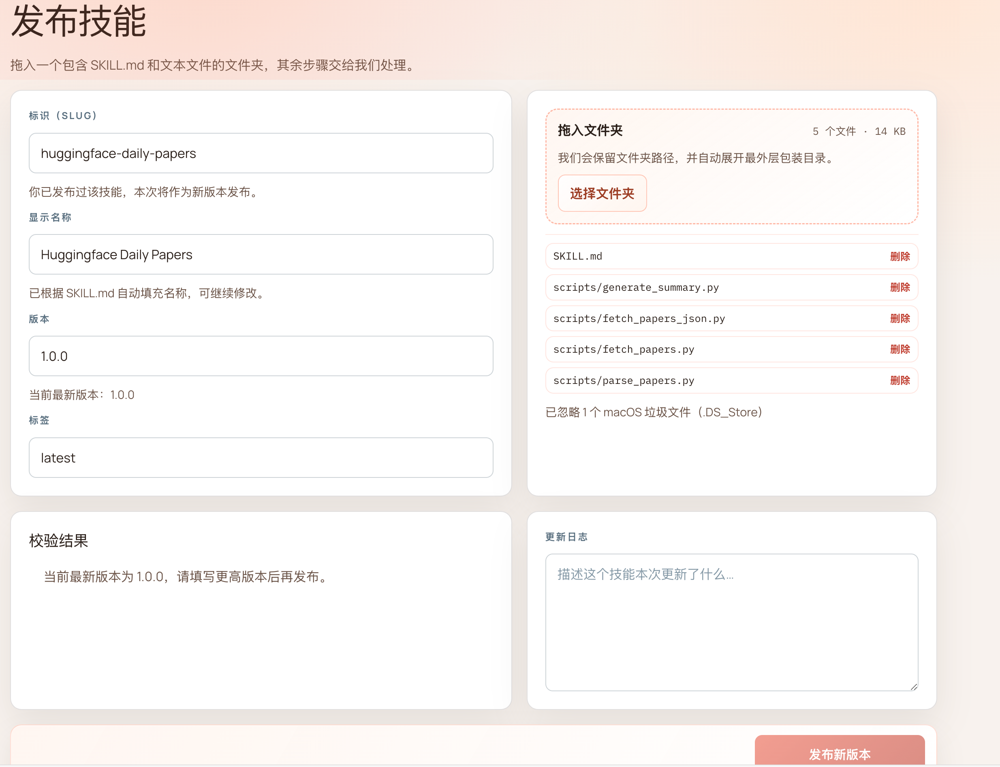
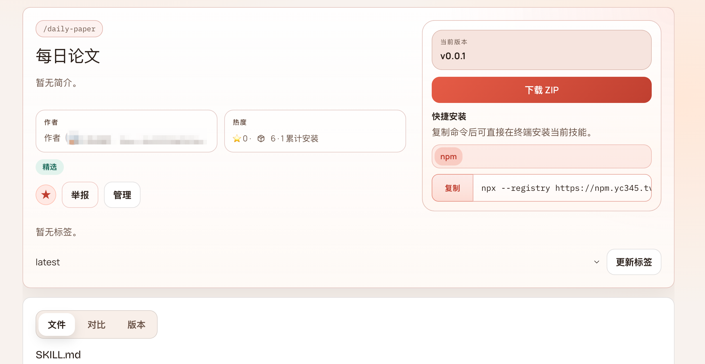
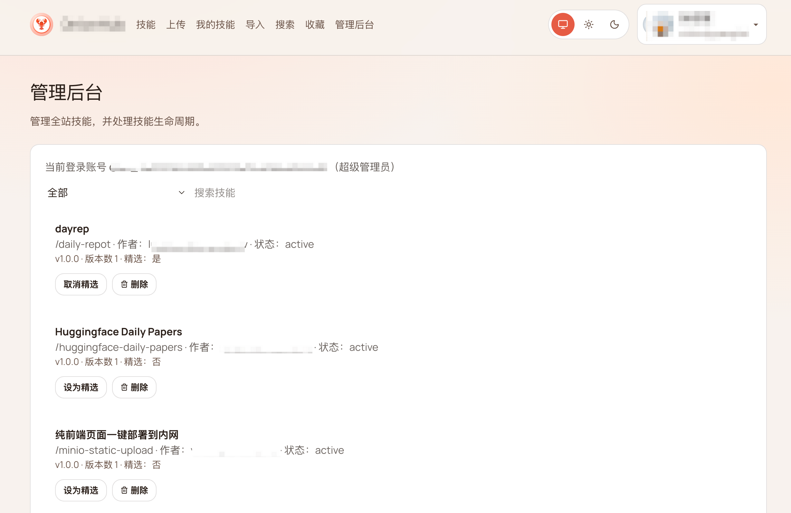

# ClawHub

[English README](README.md)

ClawHub 是一个开源、可自托管的 Agent Skill Registry，用于发布、搜索、安装和版本管理文本形式的 agent skill bundle，例如 `SKILL.md` 及其配套文件。它提供了一套完整栈，适合希望自行部署技能注册中心的团队或社区，包括 Web 界面、后端 API、PostgreSQL 元数据存储，以及 CLI 工作流。

## 当前包含

- Web 前端：浏览、搜索、发布、账户与设置
- Go 后端：认证、技能 API、评论、管理接口
- PostgreSQL：元数据、账户、身份映射与 token 存储
- CLI 包：用于安装、同步与注册中心认证

## 产品介绍

ClawHub 面向 self-host 场景设计。你可以将它部署到自己的基础设施中，接入自己的 PostgreSQL 和对象存储，并自行控制账户体系、审核流程和技能发布方式。

当前系统已经内置飞书认证能力，包括飞书登录、账号绑定和身份映射，因此很适合将飞书作为团队内部统一登录入口的场景。

系统同时具备基础的平台管理能力，包括管理员审核流程、用户管理以及技能管理接口，可以作为真正运行中的内部或社区技能平台来使用。

GitLab 集成也支持私有部署场景。当前实现下，只需要配置 GitLab 的访问 token 以及相关连接参数，就可以接入私有 GitLab 实例并完成导入与同步。

### 飞书登录

支持将飞书作为自托管部署中的主登录入口，适合团队内部访问控制。



### GitHub / GitLab 导入

支持把现有仓库内容导入到注册中心工作流中，而不是从零重新整理。



对于私有 GitLab 部署，可以将系统指向你自己的 GitLab 实例，并通过访问 token 完成带认证的导入流程。

### 技能发布

可以通过 Web 发布新技能，并配合版本化元数据与后端存储流程完成管理。



### 直接复制安装命令

每个技能都可以暴露直接可复制的安装命令，方便从界面快速接入本地 agent 环境。



### 管理后台

支持通过管理视图处理用户审核、内容管理和平台级操作。



## 技术栈

- 前端：TanStack Start + React + Vite + Bun
- 后端：Go + Gin + GORM
- 数据库：PostgreSQL
- 对象存储：S3 兼容对象存储
- CLI：TypeScript

## 仓库结构

```text
src/                前端应用
server/             SSR 与中间件
backend/            Go 后端
packages/clawhub/   CLI
packages/schema/    共享协议与类型
public/             静态资源
convex/             历史 / 兼容代码
docs/               截图与文档资源
```

## 本地开发

前置要求：

- Bun
- Go 1.22+
- Docker / Docker Compose

安装依赖：

```bash
bun install
```

创建本地环境文件：

```bash
cp .env.local.example .env.local
```

启动前端：

```bash
bun run dev
```

启动后端：

```bash
cd backend
GO_ENV=local go run cmd/server/main.go
```

默认本地端口：

- 前端：`http://localhost:10091`
- 后端：`http://localhost:10081`

## Docker Compose

启动完整环境：

```bash
docker compose up --build
```

默认会启动：

- `postgres` on `localhost:5432`
- `backend` on `http://localhost:10081`
- `frontend` on `http://localhost:10091`

顺序部署并检查 Docker 端口冲突：

```bash
bun run deploy:docker
```

如果前端依赖拉取不稳定，可以手动切换 npm registry：

```bash
NPM_REGISTRY=https://registry.npmmirror.com bun run deploy:docker
```

可选镜像覆盖参数：

```bash
POSTGRES_IMAGE=postgres:16-alpine
GO_IMAGE=golang:1.25-alpine
ALPINE_IMAGE=alpine:3.22
BUN_IMAGE=oven/bun:1.3.6
```

## 配置

可以基于这些文件开始配置：

- `.env.local.example`
- `.env.docker.example`
- `backend/config/default.yaml`

不要提交真实凭据、私有域名、数据库备份或内部文档。

## 常用命令

```bash
bun run dev
bun run build
bun run lint
bun run test
bun run deploy:docker
```

## Roadmap

- 增加收藏夹的独立展示页面
- 管理员可以管理并推荐精选收藏夹
- 支持收藏夹一条命令批量安装
- 持续完善 self-host 部署与平台运营能力

## 安全与发布建议

- 所有示例配置都应保持占位值
- 本地私有配置建议仅放在 `.env.local` 或其他未纳入版本控制的文件中
- 发布前建议再次扫描仓库：

```bash
rg -n "token|secret|password|private|internal|@your-company" .
```

## 许可证

[MIT](LICENSE)
